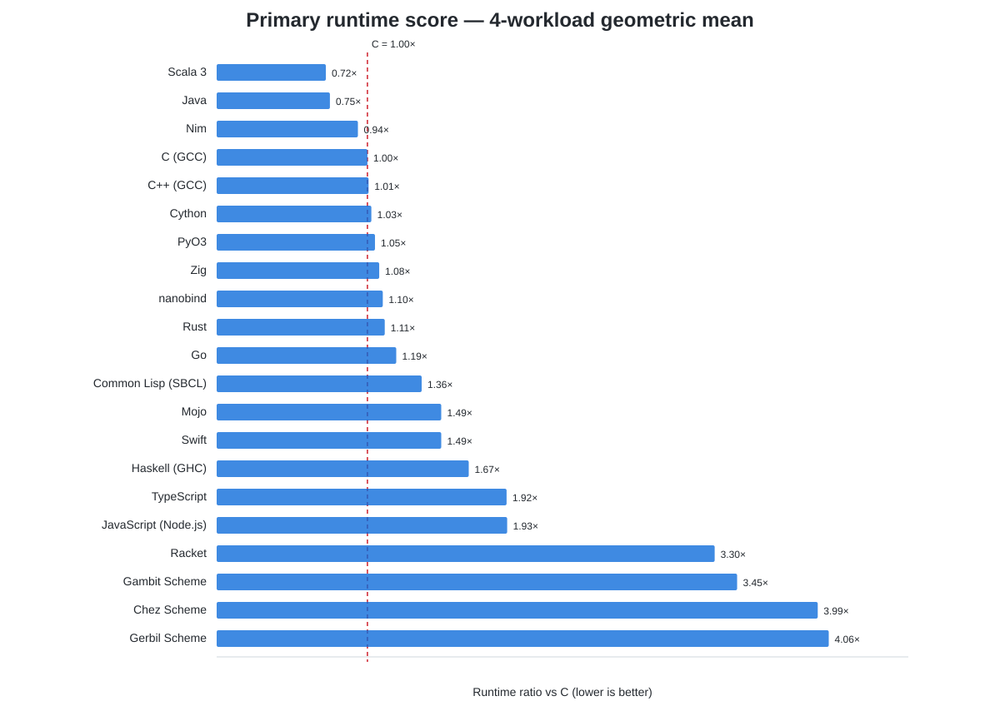
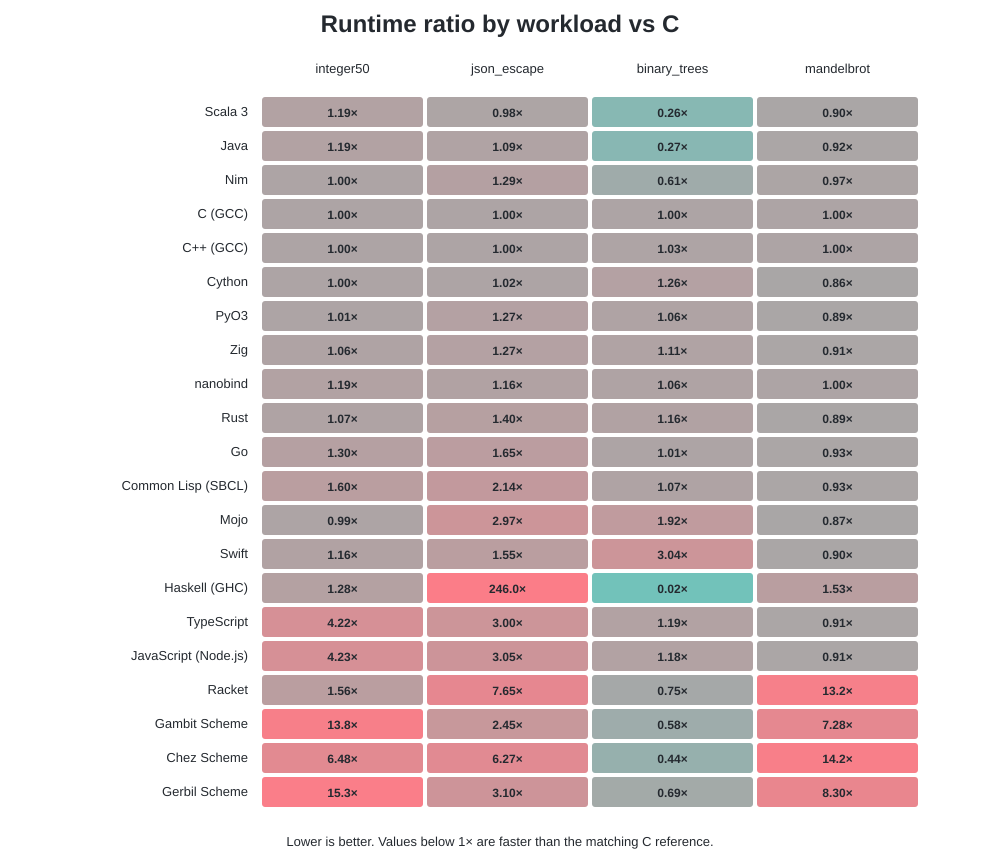
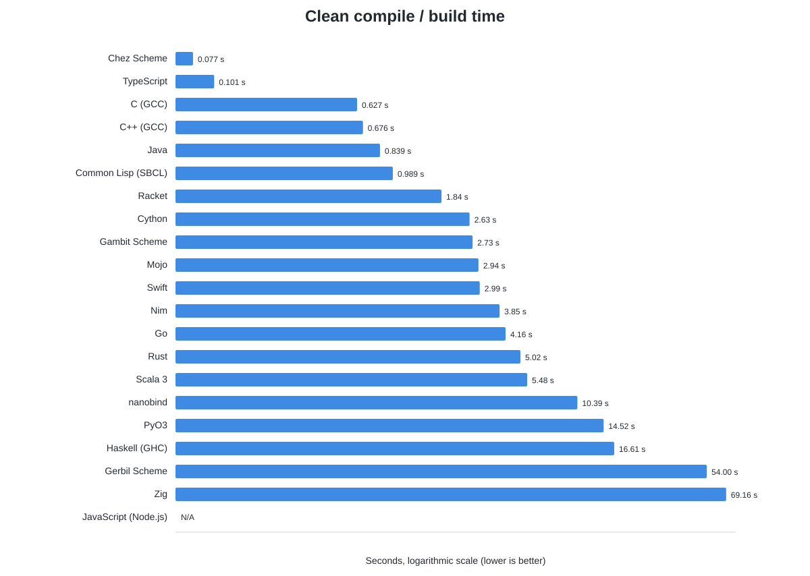
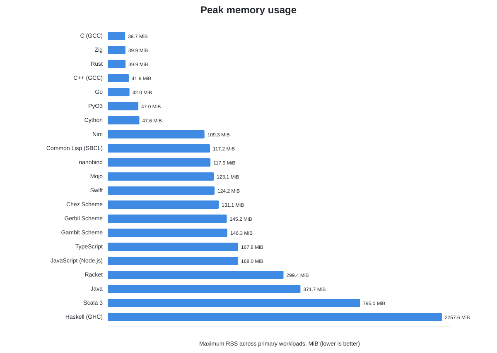
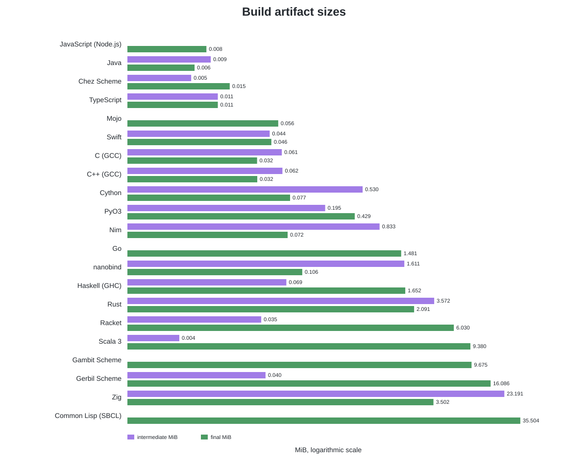

# last_benchmark

A public cross-language benchmark suite for comparing **execution speed, compilation speed, build artifact size, and memory usage** under a strict same-algorithm protocol.

## Public-data rule

This repository contains only generic benchmark code and deterministic synthetic data. It must never contain personal information, credentials, usernames, database/server configuration, production identifiers, private network information, or production data.

See [PUBLIC_REPO_POLICY.md](PUBLIC_REPO_POLICY.md). Every push and pull request runs a sensitive-data scanner before benchmark code is accepted.

## Languages and technologies

The target set is:

- C
- C++
- Cython
- nanobind
- PyO3
- Rust
- Zig
- Go
- Haskell (GHC)
- Racket
- Chez Scheme
- Gambit Scheme
- Gerbil Scheme
- Common Lisp (SBCL)
- Java
- Scala
- Swift
- Mojo
- TypeScript
- JavaScript (Node.js)
- Nim

The experimental modern Forth discussed separately is intentionally not included yet.

C and C++ use the newest stable GCC for the primary result. A newest-stable Clang/LLVM build may be reported as an additional compiler variant rather than a separate language.

## Same-algorithm suite

Four workloads form the primary 21-technology ranking; three systems-oriented workloads remain as an extended suite:

| Workload | Main pressure |
| --- | --- |
| `integer50` | scalar integer/bitwise code generation |
| `json_escape` | string scanning, branching, buffer writes, valid JSON escaping |
| `binary_trees` | allocation, pointer traversal, allocator/GC behavior |
| `mandelbrot` | scalar floating-point code generation and branches |

The primary ranking uses `integer50`, `json_escape`, `binary_trees`, and `mandelbrot`. The C implementation under `benchmarks/core/c` is the semantic reference. `stable_partition`, `binary_decode`, and `text_parse` remain available as extended systems workloads. A result is rejected unless its checksum matches [spec/EXPECTED.json](spec/EXPECTED.json).

Different algorithms, specialist libraries, unsafe shortcuts, or hand-written SIMD belong in a separate optimized/idiomatic track and never replace the same-algorithm result.

## Metrics

Each implementation reports:

| Metric | Definition |
| --- | --- |
| `compile_seconds` | clean source-to-runnable-artifact build wall time |
| `intermediate_bytes` | designated compiler-generated intermediate artifacts |
| `final_bytes` | runnable artifact size |
| `run_seconds` | median steady-state workload time after warm-up |
| `max_rss_kib` | maximum resident memory of the workload process |

The exact compiler/runtime version, optimization flags, CPU model and OS are recorded with each result. Toolchain installation/download time is excluded from compile time.

JIT/VM technologies are accounted for honestly rather than pretending they emit native ELF binaries; see [spec/BENCHMARK_SPEC.md](spec/BENCHMARK_SPEC.md).

## Optimization

Use the strongest stable optimization mode that preserves benchmark semantics. Native targets may use the runner CPU. Semantic-relaxing modes such as `-ffast-math` are excluded from the same-algorithm ranking.

Toolchains resolve to the newest stable release available at run time. A dated reproducibility snapshot is kept in [spec/TOOLCHAINS.md](spec/TOOLCHAINS.md).

## Status

All 21 requested technologies now have benchmark implementations and have completed a successful GitHub Actions validation run with checksum parity on the four primary workloads:

- C, C++, Cython, nanobind, PyO3
- Rust, Zig, Go, Nim, Swift, Mojo
- Haskell, Racket, Chez Scheme, Gambit Scheme, Gerbil Scheme, Common Lisp (SBCL)
- Java, Scala, TypeScript, JavaScript

The public-safety scanner also passes on the current main branch. A benchmark result is considered valid only when all requested workload checksums match `spec/EXPECTED.json`; successful compilation alone is not sufficient.

Per-language workflow artifacts contain the measured compile time, intermediate/final artifact sizes, workload runtime, maximum RSS, compiler/runtime version, CPU model, OS, and optimization flags.

## Benchmark results

Results below are built from the latest successful GitHub Actions artifacts available on **2026-09-29**. All four primary workload checksums match `spec/EXPECTED.json`.

### Runtime methodology

Execution speed is normalized to a C reference on the same runner whenever the artifact embeds a `c_baseline`. The composite score is the geometric mean of the four runtime ratios. **Lower is better**: `1.00×` equals C, values below 1× are faster, and values above 1× are slower.

Two legacy artifacts predate embedded `c_baseline` capture. C++ is normalized against the latest stable-GCC C result on the same AMD EPYC 7763 CPU model; Gerbil is normalized against the C baseline from the Gambit run on the same Intel Xeon Platinum 8573C CPU model.





### Build time

JavaScript has no source-level AOT compile step, so its compile time is N/A. Toolchain installation/download time is excluded.



### Peak memory

Peak RSS is the maximum resident set size observed across the four primary workloads.



### Artifact sizes

Intermediate and final artifact sizes describe files produced by the configured build. VM/JIT artifact sizes do **not** include the external runtime/JVM/Node installation, so native executables and VM artifacts are not directly equivalent.



### Summary table

| Technology | Runtime geo mean vs C | Compile s | Intermediate MiB | Final MiB | Peak RSS MiB |
| --- | ---: | ---: | ---: | ---: | ---: |
| Scala 3 | 0.72× | 5.479 | 0.004 | 9.380 | 795.0 |
| Java | 0.75× | 0.839 | 0.009 | 0.006 | 371.7 |
| Nim | 0.94× | 3.855 | 0.833 | 0.072 | 109.3 |
| C (GCC) | 1.00× | 0.627 | 0.061 | 0.032 | 39.7 |
| C++ (GCC) | 1.01× | 0.676 | 0.062 | 0.032 | 41.6 |
| Cython | 1.03× | 2.629 | 0.530 | 0.077 | 47.6 |
| PyO3 | 1.05× | 14.518 | 0.195 | 0.429 | 47.0 |
| Zig | 1.08× | 69.156 | 23.191 | 3.502 | 39.9 |
| nanobind | 1.10× | 10.387 | 1.611 | 0.106 | 117.9 |
| Rust | 1.11× | 5.024 | 3.572 | 2.091 | 39.9 |
| Go | 1.19× | 4.158 | 0.000 | 1.481 | 42.0 |
| Common Lisp (SBCL) | 1.36× | 0.989 | 0.000 | 35.504 | 117.2 |
| Mojo | 1.49× | 2.944 | 0.000 | 0.056 | 123.1 |
| Swift | 1.49× | 2.993 | 0.044 | 0.046 | 124.2 |
| Haskell (GHC) | 1.67× | 16.607 | 0.069 | 1.652 | 2257.6 |
| TypeScript | 1.92× | 0.101 | 0.011 | 0.011 | 167.8 |
| JavaScript (Node.js) | 1.93× | N/A | 0.000 | 0.008 | 168.0 |
| Racket | 3.30× | 1.838 | 0.035 | 6.030 | 299.4 |
| Gambit Scheme | 3.45× | 2.732 | 0.000 | 9.675 | 146.3 |
| Chez Scheme | 3.99× | 0.077 | 0.005 | 0.015 | 131.1 |
| Gerbil Scheme | 4.06× | 53.996 | 0.040 | 16.086 | 145.2 |

### Runtime ratios by workload

| Technology | integer50 | json_escape | binary_trees | mandelbrot |
| --- | ---: | ---: | ---: | ---: |
| Scala 3 | 1.19× | 0.98× | 0.26× | 0.90× |
| Java | 1.19× | 1.09× | 0.27× | 0.92× |
| Nim | 1.00× | 1.29× | 0.61× | 0.97× |
| C (GCC) | 1.00× | 1.00× | 1.00× | 1.00× |
| C++ (GCC) | 1.00× | 1.00× | 1.03× | 1.00× |
| Cython | 1.00× | 1.02× | 1.26× | 0.86× |
| PyO3 | 1.01× | 1.27× | 1.06× | 0.89× |
| Zig | 1.06× | 1.27× | 1.11× | 0.91× |
| nanobind | 1.19× | 1.16× | 1.06× | 1.00× |
| Rust | 1.07× | 1.40× | 1.16× | 0.89× |
| Go | 1.30× | 1.65× | 1.01× | 0.93× |
| Common Lisp (SBCL) | 1.60× | 2.14× | 1.07× | 0.93× |
| Mojo | 0.99× | 2.97× | 1.92× | 0.87× |
| Swift | 1.16× | 1.55× | 3.04× | 0.90× |
| Haskell (GHC) | 1.28× | 246.0× | 0.02× | 1.53× |
| TypeScript | 4.22× | 3.00× | 1.19× | 0.91× |
| JavaScript (Node.js) | 4.23× | 3.05× | 1.18× | 0.91× |
| Racket | 1.56× | 7.65× | 0.75× | 13.2× |
| Gambit Scheme | 13.79× | 2.45× | 0.58× | 7.28× |
| Chez Scheme | 6.48× | 6.27× | 0.44× | 14.2× |
| Gerbil Scheme | 15.29× | 3.10× | 0.69× | 8.30× |

### Notable observations

- Scala 3 and Java have the lowest four-workload geometric-mean runtime ratios in this suite, driven especially by `binary_trees`; they also use substantially more peak memory than C/Rust/Zig.
- Nim lands close to C overall while keeping a small final native artifact.
- C, C++, Cython, PyO3, Zig, nanobind and Rust cluster near the native-performance band in the composite score; Go is somewhat behind that group.
- Mojo 1.1.0 is competitive on `integer50` and `mandelbrot`, while `json_escape` and `binary_trees` pull its composite score higher.
- JavaScript and TypeScript have nearly identical runtime behavior because TypeScript is compiled to JavaScript and runs on Node/V8.
- Chez has exceptionally fast compilation in this setup, while Gambit/Gerbil are much slower than C on `integer50` and `mandelbrot`.
- Haskell's unusually low `binary_trees` time should not be interpreted as allocator throughput alone: purity/laziness and optimizer transformations can reshape or eliminate allocation while preserving the checksum.
- Compile-time measurements include configured intermediate-artifact generation. Zig emits LLVM IR for the requested intermediate-size measurement, materially increasing its measured build time.

Machine-readable aggregates are committed as [`results/summary.json`](results/summary.json) and [`results/summary.csv`](results/summary.csv).


Run the C reference locally with:

```bash
python scripts/check_public_repo.py
python scripts/measure.py c
```
