# last_benchmark

A public cross-language benchmark suite for comparing **execution speed, compilation speed, build artifact size, and memory usage** under a strict same-algorithm protocol.

## Public-data rule

This repository contains only generic benchmark code and deterministic synthetic data. It must never contain personal information, credentials, usernames, database/server configuration, production identifiers, private network information, or production data.

See [PUBLIC_REPO_POLICY.md](PUBLIC_REPO_POLICY.md). Every push and pull request runs a sensitive-data scanner before benchmark code is accepted.

## Languages and technologies

The target set is:

- C
- C++
- C3
- Cython
- nanobind
- PyO3
- Rust
- Zig
- V
- Go
- Haskell (GHC)
- Racket
- Chez Scheme
- Gambit Scheme
- Gerbil Scheme
- Common Lisp (SBCL)
- Java
- Scala
- Swift
- Mojo
- TypeScript
- JavaScript (Node.js)
- Nim

The experimental modern Forth discussed separately is intentionally not included yet.

C and C++ use the newest stable GCC for the primary result. A newest-stable Clang/LLVM build may be reported as an additional compiler variant rather than a separate language.

## Same-algorithm suite

Four workloads form the primary 21-technology ranking; three systems-oriented workloads remain as an extended suite:

| Workload | Main pressure |
| --- | --- |
| `integer50` | scalar integer/bitwise code generation |
| `json_escape` | string scanning, branching, buffer writes, valid JSON escaping |
| `binary_trees` | allocation, pointer traversal, allocator/GC behavior |
| `mandelbrot` | scalar floating-point code generation and branches |

The primary ranking uses `integer50`, `json_escape`, `binary_trees`, and `mandelbrot`. The C implementation under `benchmarks/core/c` is the semantic reference. `stable_partition`, `binary_decode`, and `text_parse` remain available as extended systems workloads. A result is rejected unless its checksum matches [spec/EXPECTED.json](spec/EXPECTED.json).

Different algorithms, specialist libraries, unsafe shortcuts, or hand-written SIMD belong in a separate optimized/idiomatic track and never replace the same-algorithm result.

## Metrics

Each implementation reports:

| Metric | Definition |
| --- | --- |
| `compile_seconds` | clean source-to-runnable-artifact build wall time |
| `intermediate_bytes` | designated compiler-generated intermediate artifacts |
| `final_bytes` | runnable artifact size |
| `run_seconds` | median steady-state workload time after warm-up |
| `max_rss_kib` | maximum resident memory of the workload process |

The exact compiler/runtime version, optimization flags, CPU model and OS are recorded with each result. Toolchain installation/download time is excluded from compile time.

JIT/VM technologies are accounted for honestly rather than pretending they emit native ELF binaries; see [spec/BENCHMARK_SPEC.md](spec/BENCHMARK_SPEC.md).

## Optimization

Use the strongest stable optimization mode that preserves benchmark semantics. Native targets may use the runner CPU. Semantic-relaxing modes such as `-ffast-math` are excluded from the same-algorithm ranking.

Toolchains resolve to the newest stable release available at run time. A dated reproducibility snapshot is kept in [spec/TOOLCHAINS.md](spec/TOOLCHAINS.md).

## Status

Benchmark v2 is complete for all 23 technologies, and every technology has a successful GitHub Actions validation run with checksum parity across all 17 v2 workloads:

- C, C++, C3, Cython, nanobind, PyO3
- Rust, Zig, V, Go, Nim, Swift, Mojo
- Haskell, Racket, Chez Scheme, Gambit Scheme, Gerbil Scheme, Common Lisp (SBCL)
- Java, Scala, TypeScript, JavaScript

The original four-workload v1 results are retained below as historical reference and cover the original 21 technologies, before C3 and V were added.

The public-safety scanner also passes on the current main branch. A benchmark result is considered valid only when all requested workload checksums match the suite's expected values; successful compilation alone is not sufficient.

Per-language workflow artifacts contain the measured compile time, intermediate/final artifact sizes, workload runtime, average and maximum RSS, compiler/runtime version, CPU model, OS, and optimization flags.

## Benchmark results

Results below use the latest successful GitHub Actions result available for each technology on **2026-09-29**. Every included result passed checksum validation for all four primary workloads.

### Runtime comparison

To control for GitHub-hosted runner variation, every language is normalized against the **C baseline measured in the same workflow run on the same machine**. The composite runtime index is the geometric mean of the four workload time ratios.

**Lower is better.** `1.00×` equals same-run C; `0.80×` means 20% less elapsed time than C; `1.25×` means 25% more.

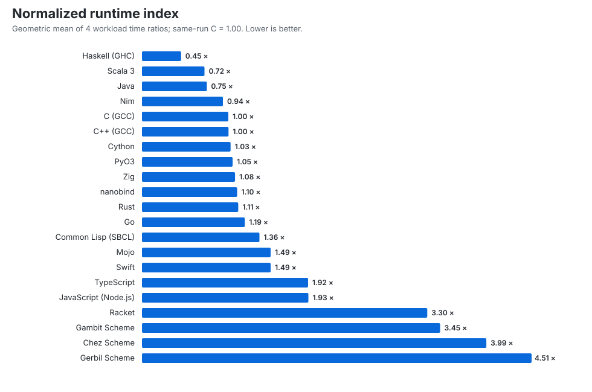

> **Important:** the composite is not a universal language ranking. GHC's `binary_trees` result is about **0.016× C**, which strongly suggests that purity/strictness analysis and optimizer transformations eliminated or fused much of the nominal allocation work while preserving the checksum. Under the current semantic benchmark this is valid, but Haskell's `0.45×` composite must not be read as “Haskell is generally 2.2× faster than C.” Use the per-workload ratios.

| Technology | Geo mean vs C | integer50 | json_escape | binary_trees | mandelbrot |
| --- | ---: | ---: | ---: | ---: | ---: |
| Haskell (GHC) | 0.45× | 1.38× | 1.24× | 0.02× | 1.51× |
| Scala 3 | 0.72× | 1.19× | 0.98× | 0.26× | 0.90× |
| Java | 0.75× | 1.19× | 1.09× | 0.27× | 0.92× |
| Nim | 0.94× | 1.00× | 1.29× | 0.61× | 0.97× |
| C (GCC) | 1.00× | 1.00× | 1.00× | 1.00× | 1.00× |
| C++ (GCC) | 1.00× | 1.00× | 1.00× | 1.01× | 1.00× |
| Cython | 1.03× | 1.00× | 1.02× | 1.26× | 0.86× |
| PyO3 | 1.05× | 1.01× | 1.27× | 1.06× | 0.89× |
| Zig | 1.08× | 1.06× | 1.27× | 1.11× | 0.91× |
| nanobind | 1.10× | 1.19× | 1.16× | 1.06× | 1.00× |
| Rust | 1.11× | 1.07× | 1.40× | 1.16× | 0.89× |
| Go | 1.19× | 1.30× | 1.65× | 1.01× | 0.93× |
| Common Lisp (SBCL) | 1.36× | 1.60× | 2.14× | 1.06× | 0.93× |
| Mojo | 1.49× | 0.99× | 2.97× | 1.92× | 0.87× |
| Swift | 1.49× | 1.17× | 1.55× | 3.04× | 0.90× |
| TypeScript | 1.92× | 4.22× | 3.00× | 1.19× | 0.91× |
| JavaScript (Node.js) | 1.93× | 4.22× | 3.05× | 1.18× | 0.91× |
| Racket | 3.30× | 1.56× | 7.65× | 0.75× | 13.23× |
| Gambit Scheme | 3.45× | 13.79× | 2.45× | 0.58× | 7.28× |
| Chez Scheme | 3.99× | 6.48× | 6.27× | 0.44× | 14.23× |
| Gerbil Scheme | 4.51× | 21.50× | 4.19× | 0.64× | 7.17× |


### Why C is not first in the composite

The composite deliberately gives the four workloads equal weight, so a very large advantage in one kernel can outweigh smaller losses in the other three. That is exactly what happens above; it does **not** mean that the languages ahead of C are generally faster than C.

- **Haskell (0.45× composite):** this is dominated by `binary_trees = 0.0163× C`. Haskell is actually slower than same-run C on the other three kernels: `integer50 = 1.381×`, `json_escape = 1.239×`, and `mandelbrot = 1.513×`. There is also an important representation caveat: the current Haskell `Leaf` is a nullary constructor, so leaf values can be shared/represented without a distinct heap allocation for every leaf, whereas the C reference allocates a `Node` with `malloc` even at depth zero. The checksum is equivalent, but the allocation work is not strictly equivalent. Therefore Haskell's composite must **not** be interpreted as “Haskell is 2.2× faster than C” or as a fair allocator comparison.
- **Scala (0.72×) and Java (0.75×):** both results are also driven mainly by `binary_trees` (`0.260×` and `0.267× C`). JVM object allocation can be extremely cheap through thread-local/bump-pointer allocation, and reclamation can be amortized or deferred by the GC; the C version pays recursive `malloc/free` cost inside the timed workload. The trade-off is visible in memory: peak RSS is about **795 MiB for Scala**, **372 MiB for Java**, versus **39.6 MiB for C**.
- **Nim (0.94×):** the advantage is much smaller and again comes mainly from `binary_trees = 0.613× C`, plus a small Mandelbrot edge (`0.973×`). Its `integer50` result is effectively tied with C (`0.999×`) and `json_escape` is slower (`1.293×`).
- If `binary_trees` is removed and only `integer50`, `json_escape`, and `mandelbrot` are geometrically averaged, the four technologies that beat C in the full composite become **Haskell 1.373×, Scala 1.019×, Java 1.061×, and Nim 1.079×**, while C remains `1.000×`. This confirms that their full-score lead is allocator/representation-sensitive rather than a broad compute lead. Cython is `0.958×` on those three kernels, so C is still not guaranteed to win every code-generation pattern.

The useful conclusion is therefore workload-specific: **C/C++ are the most consistently close to the baseline across all four kernels and combine that consistency with very low memory use and tiny native artifacts.** The composite is a compact summary, not a universal “fastest language” verdict.


### Compile / build time

Toolchain installation and dependency download time are excluded. JavaScript has no source-level compile step and is omitted.

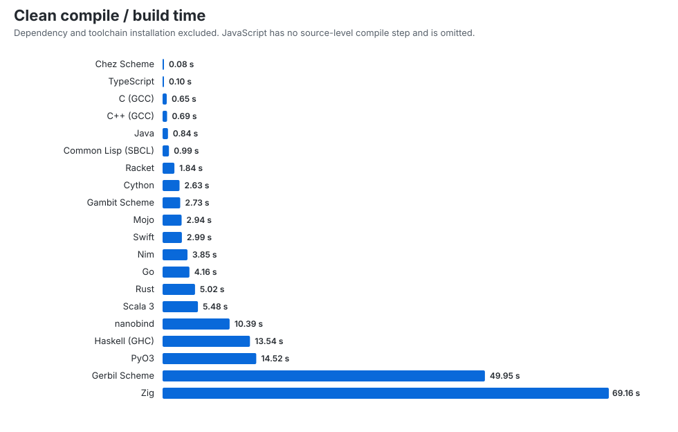

### Peak memory

Peak RSS is the maximum resident memory observed for the workload process among the four primary workloads. VM/JIT processes include their runtime memory.

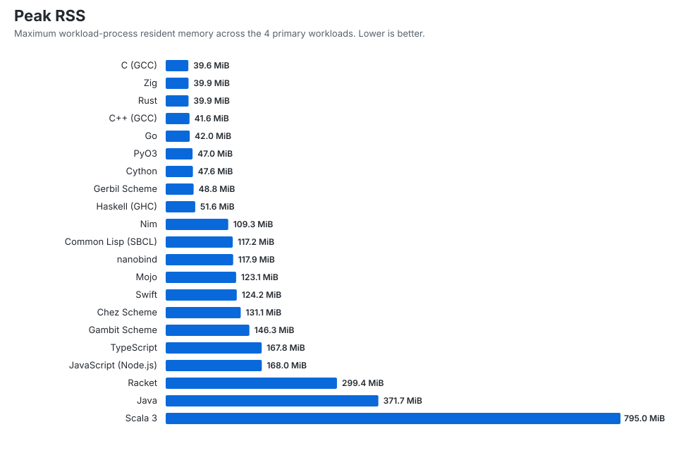

### Final artifact size

Bars use a log scale because artifacts range from a few KiB to tens of MiB. The number is the configured runnable artifact only; external runtimes such as the JVM or Node.js are not bundled unless the build naturally includes them.

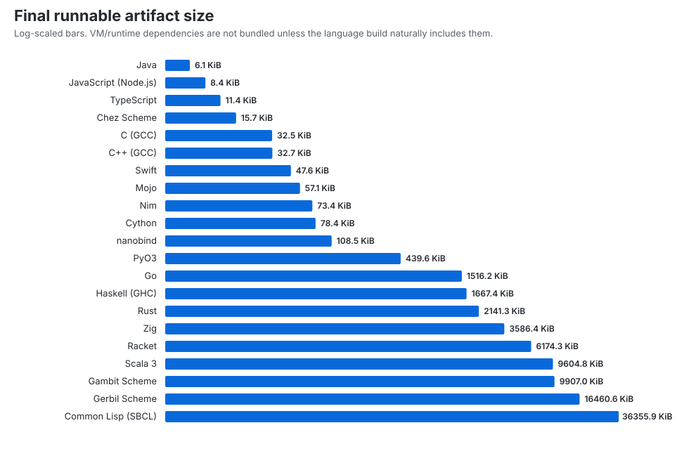

### Build and resource table

| Technology | Compile s | Intermediate MiB | Final MiB | Peak RSS MiB |
| --- | ---: | ---: | ---: | ---: |
| Chez Scheme | 0.077 | 0.005 | 0.015 | 131.1 |
| TypeScript | 0.101 | 0.011 | 0.011 | 167.8 |
| C (GCC) | 0.646 | 0.061 | 0.032 | 39.6 |
| C++ (GCC) | 0.693 | 0.062 | 0.032 | 41.6 |
| Java | 0.839 | 0.009 | 0.006 | 371.7 |
| Common Lisp (SBCL) | 0.989 | 0.000 | 35.504 | 117.2 |
| Racket | 1.838 | 0.035 | 6.030 | 299.4 |
| Cython | 2.629 | 0.530 | 0.077 | 47.6 |
| Gambit Scheme | 2.732 | 0.000 | 9.675 | 146.3 |
| Mojo | 2.944 | 0.000 | 0.056 | 123.1 |
| Swift | 2.993 | 0.044 | 0.046 | 124.2 |
| Nim | 3.855 | 0.833 | 0.072 | 109.3 |
| Go | 4.158 | 0.000 | 1.481 | 42.0 |
| Rust | 5.024 | 3.572 | 2.091 | 39.9 |
| Scala 3 | 5.479 | 0.004 | 9.380 | 795.0 |
| nanobind | 10.387 | 1.611 | 0.106 | 117.9 |
| Haskell (GHC) | 13.542 | 0.058 | 1.628 | 51.6 |
| PyO3 | 14.518 | 0.195 | 0.429 | 47.0 |
| Gerbil Scheme | 49.951 | 0.040 | 16.075 | 48.8 |
| Zig | 69.156 | 23.191 | 3.502 | 39.9 |
| JavaScript (Node.js) | N/A | 0.000 | 0.008 | 168.0 |

### What stands out

- **Native tight-loop band:** C, C++, Cython, PyO3, Zig, nanobind, Rust, Nim and Go are broadly in the C-class performance envelope across these kernels, though workload-specific costs differ.
- **Nim:** the composite runtime is close to C (`0.94×`) while retaining a small native artifact.
- **Mojo 1.1.0:** `integer50` and `mandelbrot` are competitive with or faster than its same-run C baseline, while `json_escape` and `binary_trees` are the current weak points.
- **JVM:** Java and Scala are especially strong on `binary_trees`, but their peak RSS is much higher than C/Rust/Zig; Scala reached about **795 MiB**.
- **JavaScript / TypeScript:** V8 keeps `mandelbrot` close to C, but the exact 50-bit integer workload is about **4.2× C**. TS and JS runtime results are nearly identical, as expected after TypeScript lowers to JavaScript.
- **Lisp/Scheme family:** SBCL is the strongest all-round result of this group here. Chez compiles extremely quickly (**0.077 s**) but is substantially slower on the integer and Mandelbrot kernels.
- **Compile latency:** C/C++ are below a second; Chez and TypeScript are even faster. Zig is the slowest measured build (**69.16 s**) because this benchmark also requests LLVM IR as an intermediate artifact.
- **Artifact size:** C/C++ are about **33 KiB** here. Java's JAR and JS/TS source artifacts are smaller but require external runtimes, so those figures are not equivalent to standalone native executables.

Machine-readable results: [`results/summary.json`](results/summary.json) and [`results/summary.csv`](results/summary.csv).

Run the C reference locally with:

```bash
python scripts/check_public_repo.py
python scripts/measure.py c
```

<!-- BENCHMARK_V2_START -->
## Benchmark v2 results

The v2 suite benchmarks common algorithms and data structures and records runtime, compile/build time, intermediate and final artifact size, average runtime RSS, and peak runtime RSS.

### Composite score

The composite is cohort-relative 0-100; higher is better. Lower-is-better raw metrics are logarithmically normalized before weighting.

| Metric | Weight |
| --- | ---: |
| Runtime | 50.0% |
| Compile/build time | 15.0% |
| Average runtime memory | 15.0% |
| Peak runtime memory | 15.0% |
| Intermediate artifact size | 2.5% |
| Final artifact size | 2.5% |

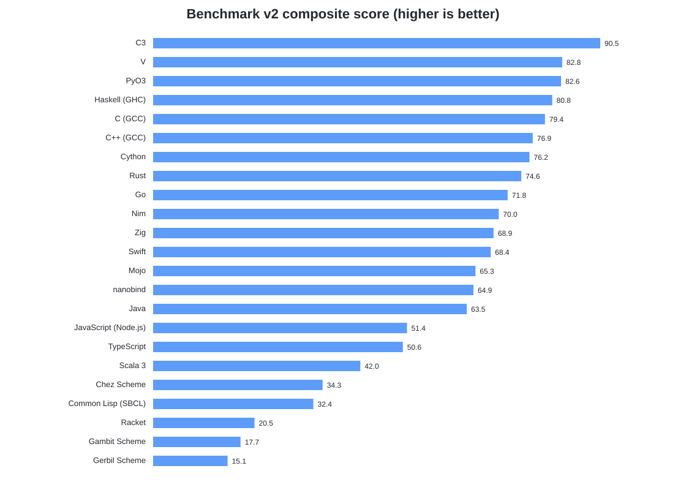

| Technology | Composite | Runtime vs C | Compile vs C | Avg RSS vs C | Peak RSS vs C | Intermediate vs C | Final vs C |
| --- | ---: | ---: | ---: | ---: | ---: | ---: | ---: |
| PyO3 | 87.0 | 0.388x | 6.010x | 1.971x | 1.093x | 2.647x | 16.184x |
| Haskell (GHC) | 85.3 | 0.296x | 7.273x | 1.783x | 2.288x | 2.567x | 54.666x |
| C (GCC) | 82.3 | 1.000x | 1.000x | 1.000x | 1.000x | 1.000x | 1.000x |
| C++ (GCC) | 80.8 | 1.021x | 1.089x | 1.250x | 1.022x | 1.016x | 1.002x |
| Cython | 80.3 | 0.889x | 0.773x | 1.837x | 1.090x | 9.258x | 3.689x |
| C3 | 78.6 | 0.950x | 3.765x | 1.025x | 1.002x | 41.257x | 18.009x |
| Rust | 77.5 | 1.067x | 1.175x | 1.188x | 1.007x | 41.803x | 68.215x |
| Go | 73.7 | 1.155x | 2.553x | 1.552x | 1.405x | 0.000x | 47.428x |
| Zig | 72.4 | 0.934x | 27.599x | 1.042x | 1.004x | 280.239x | 116.034x |
| Swift | 72.3 | 1.144x | 1.630x | 2.753x | 1.314x | 1.157x | 2.512x |
| Nim | 71.4 | 1.261x | 6.297x | 1.320x | 1.190x | 12.632x | 3.083x |
| nanobind | 70.1 | 0.975x | 29.735x | 2.002x | 1.107x | 18.961x | 3.855x |
| Mojo | 68.0 | 1.400x | 1.871x | 2.917x | 1.327x | 0.000x | 2.685x |
| Java | 65.1 | 1.200x | 0.393x | 5.436x | 2.748x | 0.158x | 0.261x |
| V | 57.9 | 1.890x | 15.319x | 1.523x | 2.038x | 0.000x | 8.260x |
| JavaScript (Node.js) | 54.3 | 1.734x | 0.000x | 5.822x | 4.753x | 0.000x | 0.371x |
| TypeScript | 54.1 | 1.729x | 0.043x | 5.720x | 4.843x | 0.204x | 0.569x |
| Scala 3 | 45.2 | 1.450x | 2.543x | 6.872x | 11.027x | 0.176x | 298.045x |
| Common Lisp (SBCL) | 41.4 | 3.180x | 0.168x | 6.292x | 1.964x | 0.000x | 1128.378x |
| Chez Scheme | 30.9 | 4.357x | 0.056x | 4.958x | 4.915x | 0.363x | 2.427x |
| Racket | 26.4 | 3.938x | 0.294x | 10.428x | 4.601x | 0.874x | 192.439x |
| Gambit Scheme | 20.0 | 4.085x | 95.726x | 4.825x | 4.342x | 0.000x | 331.637x |
| Gerbil Scheme | 16.7 | 3.503x | 250.266x | 8.050x | 4.631x | 2.140x | 673.319x |

### Runtime by workload

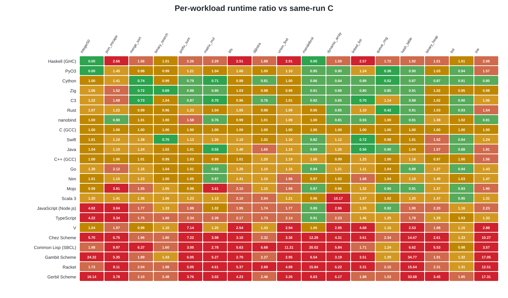

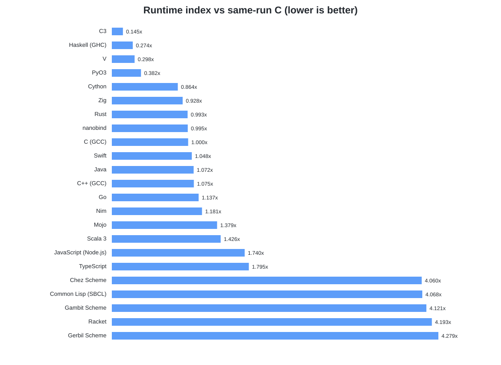

### Build, memory and artifact metrics

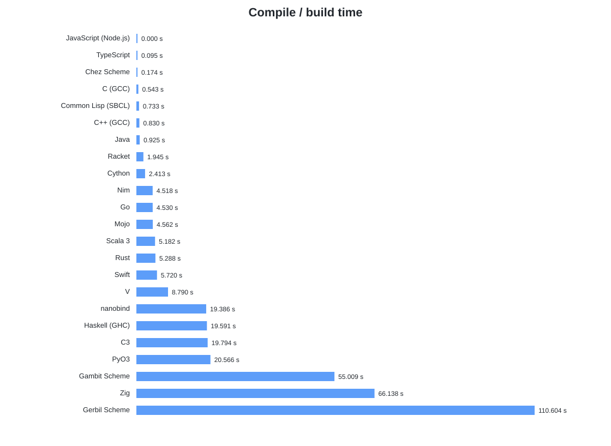

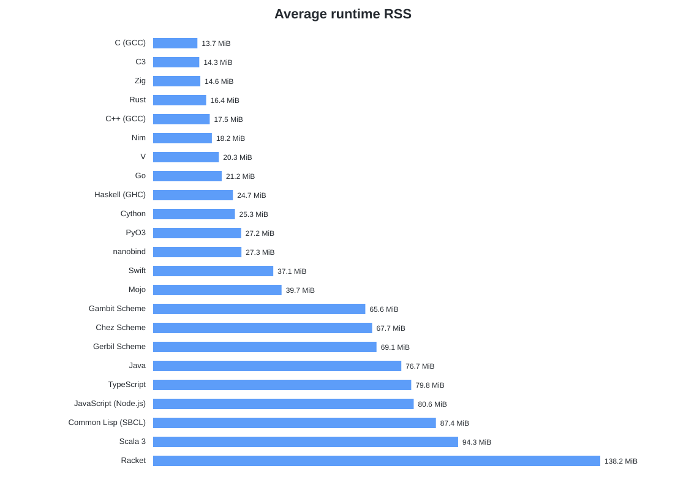

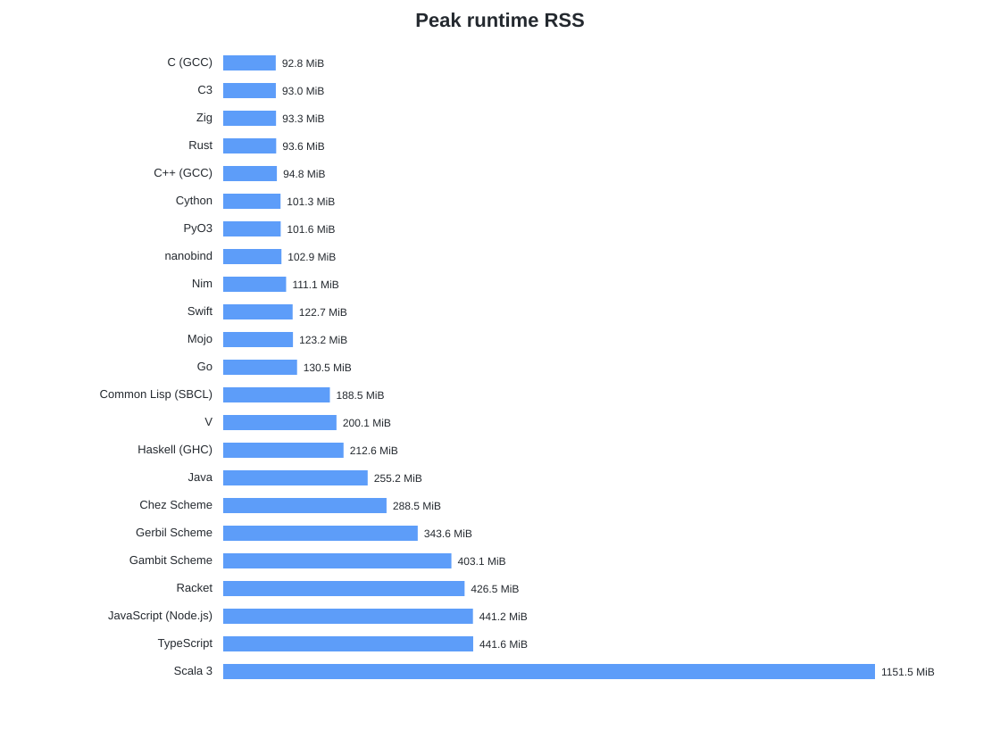

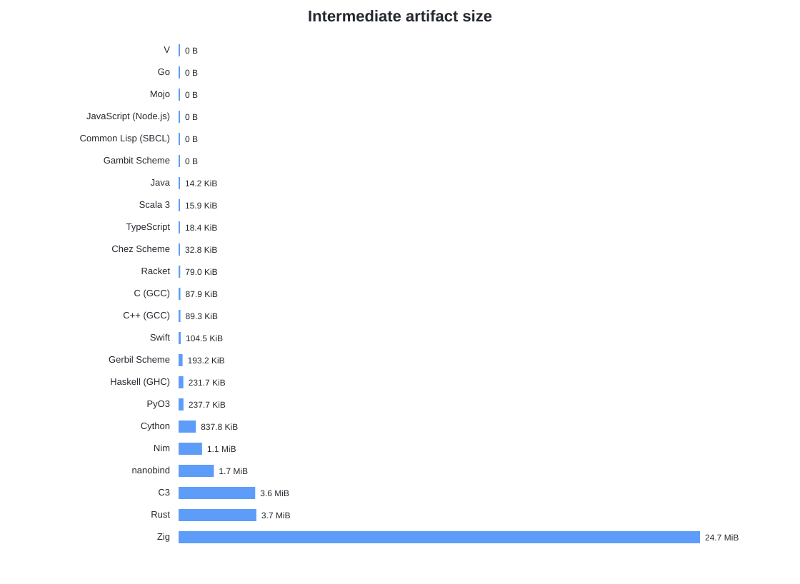

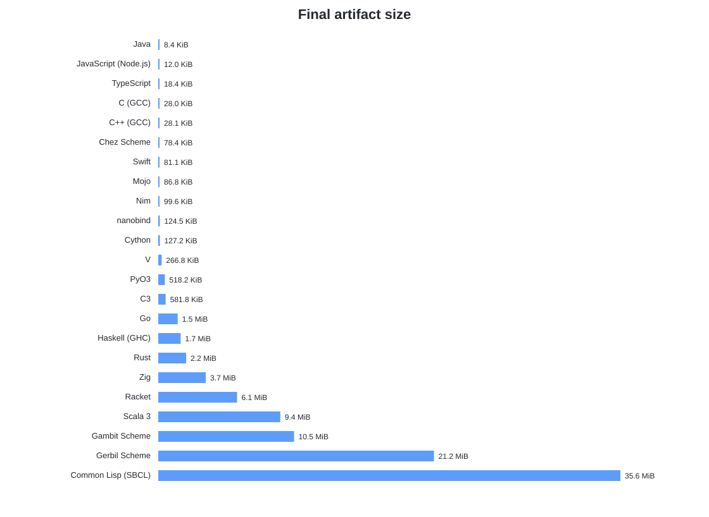

Machine-readable results: results/summary_v2.json and results/summary_v2.csv. Methodology: spec/BENCHMARK_V2.md.

> Artifact-size caveat: VM/JIT and extension-module results may rely on an external runtime that is not bundled into the reported artifact.

<!-- BENCHMARK_V2_END -->
